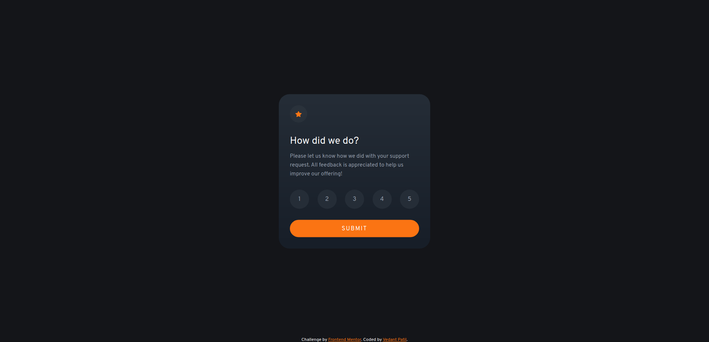
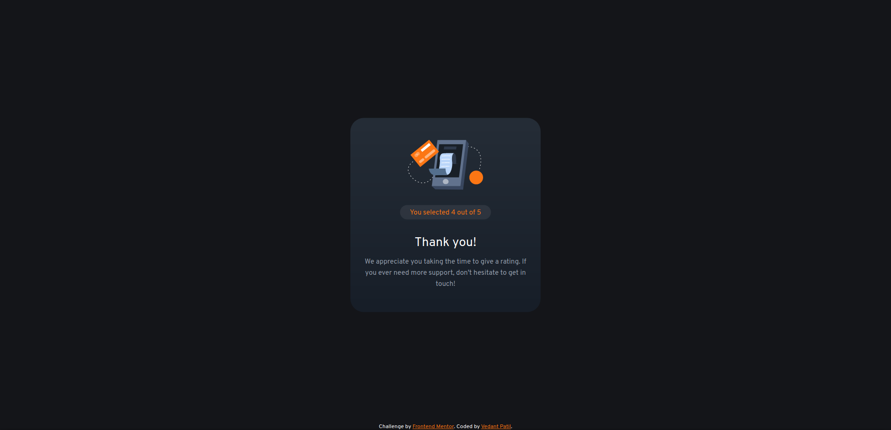

# Frontend Mentor - Interactive rating component solution

This is a solution to the [Interactive rating component challenge on Frontend Mentor](https://www.frontendmentor.io/challenges/interactive-rating-component-koxpeBUmI).

## Table of contents

- [The challenge](#the-challenge)
- [Screenshots](#screenshots)
- [Links](#links)

## Overview

### The challenge

Users should be able to:

- View the optimal layout for the app depending on their device's screen size
- See hover states for all interactive elements on the page
- Select and submit a number rating
- See the "Thank you" card state after submitting a rating

### Screenshots

<!-- 
 -->

### Links

- Solution URL: [url](https://github.com/Vedant2254/Frontend-mentor/tree/master/interactive-rating-component-main)
- Live Site URL: [url](https://vedant2254.github.io/Frontend-mentor/interactive-rating-component-main)
